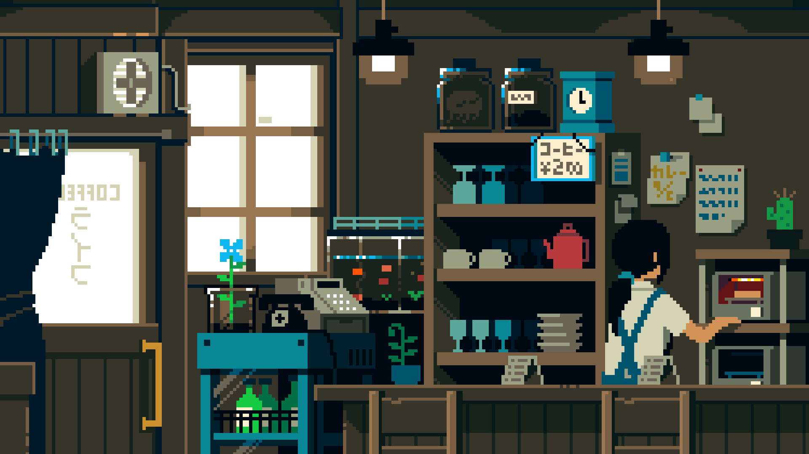

  

<h1 Brainstorming, Breaking, and Building the Multiverse of Code! </h1>

<h1 align="center">
  Hi There!  I'm
</h1>

<h1 align="center">
  <b>✨ Sejal Pusate ✨</b>
</h1>

  

<h3 align="center">A passionate full stack developer from India</h3>

  

  

  

- 🔭 I’m currently working on **AI Document Search Chatbot**

- 🌱 I’m currently learning **Data Science and AI**

- 👯 I’m looking to collaborate on [AI- based Resume and Cover letter builder](https://github.com/sejalPusate/AI-based-Resume-and-Cover-letter-Builder)

- 🤝 I’m looking for help with [Zomato Clone](https://github.com/sejalPusate/zomato-clone)

- 📫 How to reach me **sejalpusate@gmail.com**

<h3 align="left">Connect with me:</h3>

## 🚀 Languages, Tools & Technologies

<table>
  <tr>
    <th align="left">Programming Languages</th>
    <td>
      
      
      
      
      
    </td>
  </tr>

  <tr>
    <th align="left">Frontend Development</th>
    <td>
      
      
      
    </td>
  </tr>

  <tr>
    <th align="left">Backend Development</th>
    <td>
      
      
    </td>
  </tr>

  <tr>
    <th align="left">Database Technologies</th>
    <td>
      
      
    </td>
  </tr>

  <tr>
    <th align="left">Frameworks & Libraries</th>
    <td>
      
      
    </td>
  </tr>

  <tr>
    <th align="left">Deployment</th>
    <td>
      
      
    </td>
  </tr>

  <tr>
    <th align="left">Cloud Deployment</th>
    <td>
      
    </td>
  </tr>

  <tr>
    <th align="left">Debugging Tools</th>
    <td>
      
      
      
    </td>
  </tr>

  <tr>
    <th align="left">Operating System</th>
    <td>
      
    </td>
  </tr>
</table>

